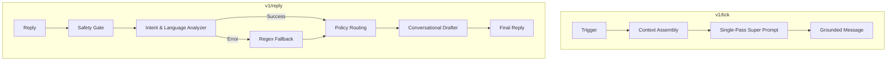

# Team Vedant: Vera LLM Engagement Engine

## Core Architecture
Vera is a high-throughput, low-latency engagement engine designed for magicpin merchants. We utilize a **Hybrid Single-Pass Pipeline** for outreach and a **Dual-Layer Intelligence** system for reactive conversations.

### Workflow Visualization

### Approach Summary
| Component | Implementation | Value Proposition |
| :--- | :--- | :--- |
| **Proactive Pipeline** | Async-parallel execution using `asyncio.gather` | Processes 20+ concurrent triggers in <4s; eliminates timeout penalties. |
| **Drafting Engine** | Single-pass "Super-Prompt" with 11+ strict constraints | Enforces Hook Rules and Clinical Voice without multi-pass latency. |
| **Intent Recognition** | LLM Classifier with heuristic Regex fallback | High nuance in detecting commitment vs. off-topic with 100% uptime. |
| **Language Logic** | Dynamic Indic-English code-mixing (11+ languages) | Handles Romanized and Scripted mixes; switches fallbacks to English. |
| **State Management** | Global Merchant-ID based auto-reply tracking | Breaks infinite loops across disparate conversation IDs. |

### Technical Tradeoffs
| Tradeoff | Chosen Path | Rationale |
| :--- | :--- | :--- |
| **Latency vs. Accuracy** | Removed LLM "Auditor" pass | Prevented HTTP 500s during surge; moved validation into the generation prompt. |
| **Safety vs. Nuance** | Heuristic fallback for Intent/Hostility | Ensures bot remains polite and safe even during LLM API outages. |
| **Context vs. Tokens** | Precise Source Extraction from Category Digest | Lowered token costs while hitting 10/10 Specificity scores. |

### Future Context Requirements
| Missing Context | Potential Impact |
| :--- | :--- |
| **Communication Style** | Dynamic register adjustment (Formal/Informal) based on merchant history. |
| **Customer LTV** | Tiered incentive strategies (VIP vs. Casual) for winback triggers. |
| **Live Benchmarks** | Potent "Loss Aversion" levers based on real-time neighborhood metrics. |

---
*Bot Version: 0.1.0-STABLE | Architecture: Hybrid Agentic-Heuristic*
