# Team Vedant: Vera LLM Engagement Engine

## Our Approach: The Hybrid "Single-Pass" Architecture

We built Vera to be a high-frequency, low-friction, and highly resilient engagement engine. Early in development, we experimented with a multi-agent workflow. While quality was high, the latency (~25s per message) caused massive timeouts when processing concurrent trigger batches. 

To solve this, we engineered a **Hybrid Single-Pass Pipeline** for proactive messaging and a **Dual-Layer Intelligence** system for reactive conversations.

### Architecture Flow

```mermaid
graph TD
    %% Proactive Flow
    subgraph Proactive Outreach [v1/tick]
        T[Trigger Payload] --> P1[Python: Context Assembly]
        P1 --> |Lookup Source/Extract Active Offers| LLM1[LLM: Single-Pass Super Prompt]
        LLM1 --> |Enforce Hooks & Engagement| OUT1[Drafted Message]
    end

    %% Reactive Flow
    subgraph Conversational Reply [v1/reply]
        R[User Reply] --> S[Python: State & Hostility Gate]
        S --> LLM2[LLM Analyzer: Intent & Language]
        LLM2 -->|Timeout/Error| F1[Python: Regex Fallback]
        LLM2 -->|Success| R1[Route Policy Intent]
        F1 --> R1
        R1 --> LLM3[LLM: Conversational Drafter]
        LLM3 --> OUT2[Final Reply]
    end
```

### Key Engineering Decisions

1. **The "Super-Prompt" Execution (Proactive)**: We consolidated all drafting logic into a single, heavily constrained prompt. Rather than relying on a post-generation auditor, we enforce strict rules *during* generation (e.g., `MANDATORY DATES`, `TERMINAL HOOK RULE`, `ENGAGEMENT COMPULSION`). 
2. **Dual-Layer Intelligence (Reactive)**: For `/v1/reply`, we use a fast LLM call to classify the user's hostility, intent, and exact language dialect (handling Romanized Indic mixes dynamically). If this LLM call times out or fails, the system seamlessly falls back to Python regex heuristics, guaranteeing zero conversational downtime.
3. **Advanced State Management**: We implemented global, cross-session memory tracking. For example, if a merchant's system spams auto-replies across multiple new conversation threads, Vera tracks the auto-reply count globally by Merchant ID. She issues a polite, graceful exit on the 2nd auto-reply and initiates a hard stop on the 3rd, preventing infinite loops.
4. **Offer-Anchored Engagement**: A message is never just "Your views are up". It is strictly framed using **Loss Aversion** ("Don't let these potential patients drop off") and inextricably anchored to the merchant's specific **Active Offer**.

## Tradeoffs Made
*   **Latency vs. Self-Correction**: We deliberately removed a secondary "LLM Auditor" pass to prevent HTTP 500 timeouts under load. We mitigated the risk of hallucination by strictly filtering the context passed to the LLM (e.g., extracting precise citations from Category Digests and forcing the LLM to use exact terms like 'calls' instead of 'leads').
*   **Dual LLM Calls in Reply Mode**: Conversational replies require two LLM calls (Analyzer + Drafter). This adds slight latency to chats but drastically improves our ability to understand complex, multi-lingual merchant intents compared to regex alone.

## What Additional Context Would Have Helped
1.  **Merchant Communication History**: Knowing *how* the merchant typically replies (e.g., short texts vs. formal language) would have allowed us to adjust Vera's outgoing register dynamically, rather than relying solely on the broad Category voice.
2.  **Customer LTV (Lifetime Value)**: For customer-facing triggers (`winback`, `recall_due`), having an explicit LTV or "Loyalty Tier" would have allowed us to dynamically alter the incentive (e.g., offering a VIP 20% discount vs. a standard reminder).
3.  **Real-Time Competitor Benchmarks**: While we had static peer averages, real-time context like "Your CTR dropped below the neighborhood average *today*" would have made our Loss Aversion levers significantly more potent.
